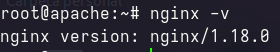
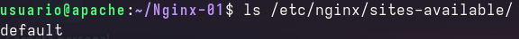
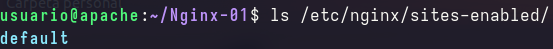
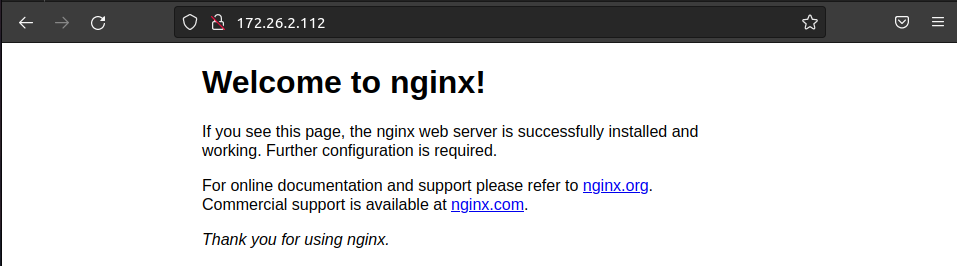
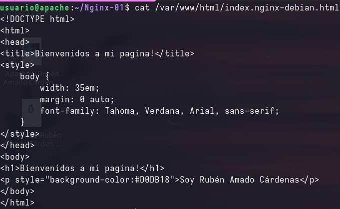
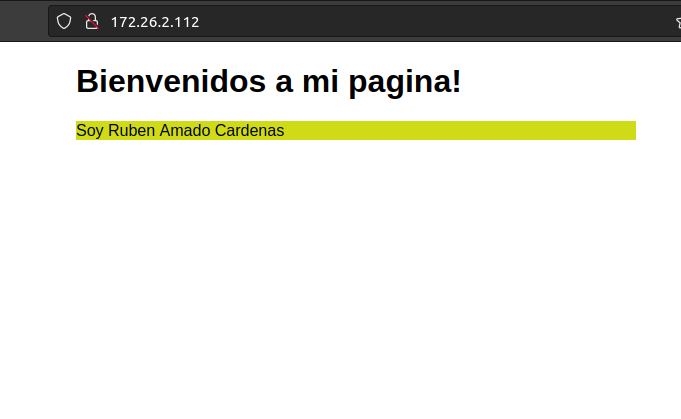

# Casos prácticos.

## Versión de NGINX.

Para ver la versión de NGINX instalada se utiliza este comando.

`nginx -v`

## Ficheros de configuración.

Los ficheros de configuración de NGINX se encuentran en la ruta "/etc/nginx/"

Existen muchos ficheros, pero en esta ocasión solo utilizaré:

- nginx.conf:Fichero encargado de la configuración general de NGINX.

- sites-available:Directorio donde almacenaramos nuestros sitios virtuales. Por defecto, nos crea con la instalación, un sitio virtual que podemos utilizar como referencia para nuevos sitios. 

- sites-enable:Directorio donde están los sitios que tenemos activados. Crea un enlace simbólico de los ficheros de sites-available.

## Pagina web por defecto

El contenido de nuestras páginas web se alamcena en /var/www/. La página web por defecto de NGINX se encuentra en el directorio html. La página es index.nginx-debian.html:

Este es el resultado despues de modificar la página por defecto:

## Balanceo de carga

El balanceo de carga es una técnica que se utiliza para distribuir las solicitudes entrantes al grupo de servidores del backend. De esta manera, permite agregar muchos servidores cuando aumenta el tráfico.

Para realizar la practica, necesaitré usar tres servidores con nginx instalado en cada uno. Uno contendrá una página web, utilizaré el ya creado en las practicas anteriores. Otro con otra página web y uno que hará de balanceo de carga. Además, los tres servidores se counicarán por una red interna.

- Servdior segunda pagina

- Servidor balanceo de carga

